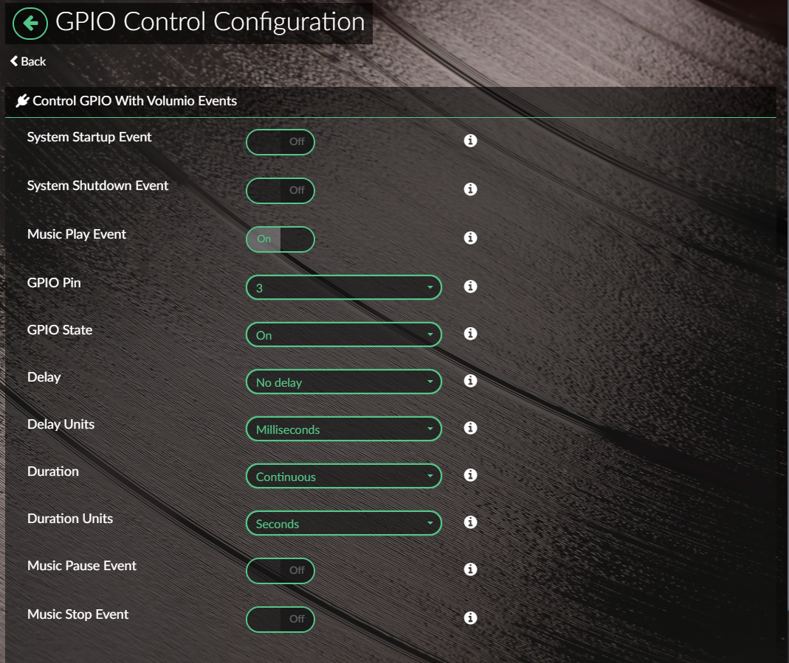
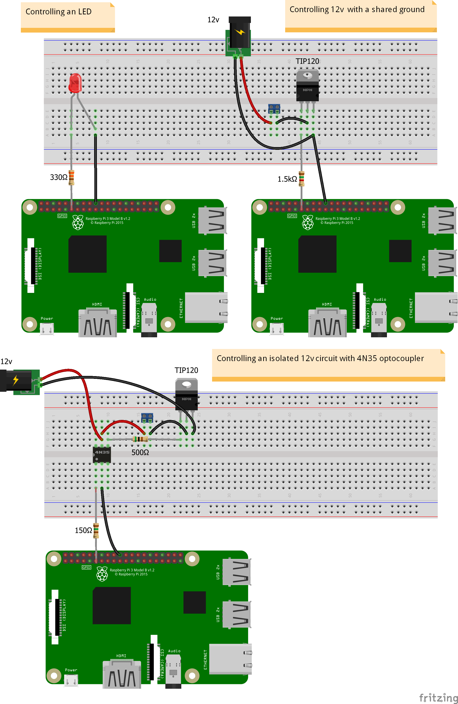

# GPIO Control

- This plugin can react to Volumio events and control GPIO pins.  The events are: system startup, system shutdown, music start, music stop and music pause.

- You can setup a delay before the GPIO is changed and you can control how long the GPIO state is set for.

- You can use this plugin to turn on an LED when a song starts playing or even control an amplifier when Volumio starts or after a specified delay!

- This has been extensively tested and runs stable on a RPi Zero.

- This plugin is based on tomatpasser's gpio-buttons https://github.com/tomatpasser/gpio-buttons/

# Instructions

- In the configuration pages Volumio events can to enabled to control a defined GPIO pin and set its state.

- The pin numbers are GPIO pin numbers.  Always double check what pins you are writing too.  The default value for each pin is shown below.

__Remember never to connect 5V to the GPIO pins, only 3.3V or ground.__

__Remember to use a resistor when connecting LEDs.__

__Do not source more than 16mA per pin with total current from all pins no excedding 51mA.  Keep reading to see how to get around this.__

| GPIO Pin      | Default pull  | GPIO Pin      | Default pull  |
| :-----------: |:-------------:| :-----------: |:-------------:|
| 2             | high          | 15            | low           |
| 3             | high          | 16            | low           |
| 4             | high          | 17            | low           |
| 5             | high          | 18            | low           |
| 6             | high          | 19            | low           |
| 7             | high          | 20            | low           |
| 8             | high          | 21            | low           |
| 9             | low           | 22            | low           |
| 10            | low           | 23            | low           |
| 11            | low           | 24            | low           |
| 12            | low           | 25            | low           |
| 13            | low           | 26            | low           |
| 14            | low           | 27            | low           |

__Controlling 5/12v Devices and Beyond__ 

- If you need more current or wish to control devices above 3.3v then you can get away with a TIP120 darlington transistor and a resistor, as long as the Pi and the device share a commond ground.  

- If a commond ground is not available then you can throw in a 4N25 optocoupler to isolate both circuits.  I've used this to control an audio amplifier that a ground voltage at -12v with respect to the Pi's ground.

- Please see the schematics below for more infomration on how to achieve this.

__Schematics__

Your Pi is easily fried so here are some ways to connect it to devices.

1. Single LED on GPIO pin 17 with a resistor
2. 12v device on GPIO pin 17 with a shared ground connection
3. 12v device on GPIO pin 17 with both circuits isolated

