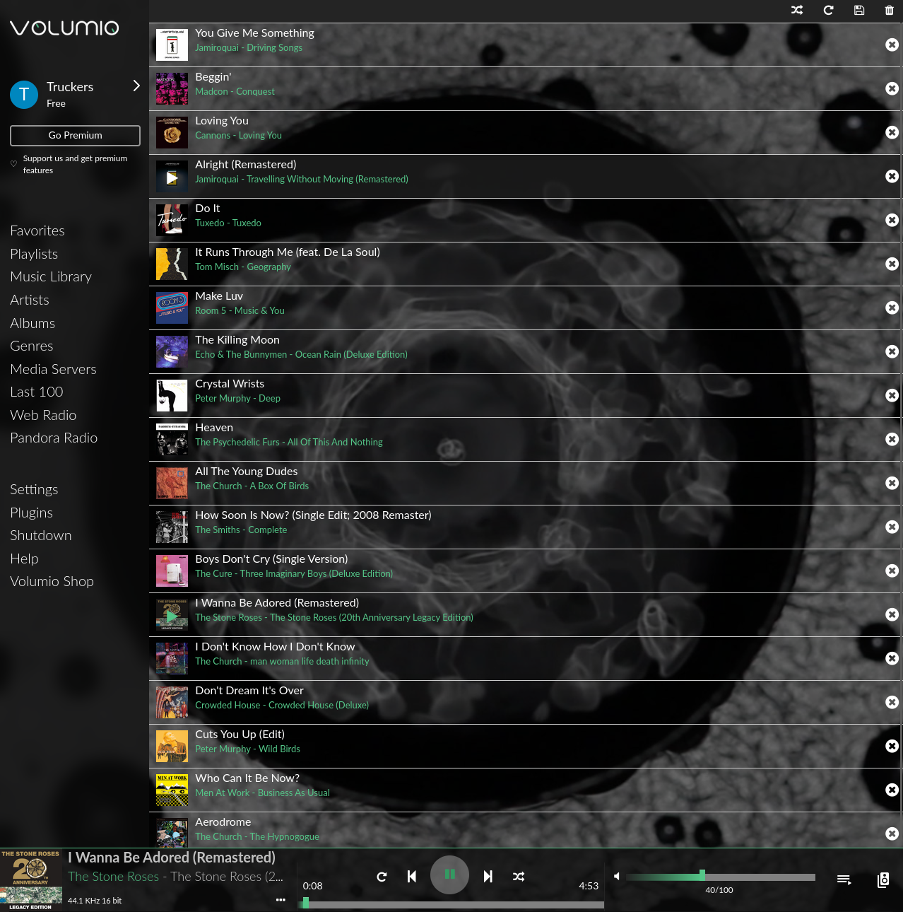

# Pandora plugin for Volumio

Install the plugin as usual from the Volumio menu, or see [Manual_Installation.md](Manual_Installation.md) for manual installation instructions.

Go to the Plugins sidebar in Volumio and enable the Pandora plugin.  On the first run, you will have to enter your credentials with the settings button.  You may need to restart the plugin or restart Volumio after this step.

The stations will populate after login.  You can browse to the Pandora icon and then load a station. 
The station list is (currently -- is this needed?) not refreshed until you reload the plugin, so if a new station is added, the index will be wrong.

You should be up and running at this point.

## Prerequisites

I can't think of any prerequistes other than SSH access to Volumio and a Pandora account. 

## Change Log

See [CHANGELOG.md](CHANGELOG.md)
## Issues

* ~~Next track is not working properly.  Hopefully there will be a fix!~~ 
Previous and Next buttons now work as expected.  The key was this: 
`self.commandRouter.stateMachine.setConsumeUpdateService = your-service-here` 
After that, the functions defined for previous and next in the plugin worked fine.
* There may be a few bugs left.  I have been working on this for a while but you never know.  I can say that it will play and play if you leave it alone.
* If you run Volumio on a PC in a browser tab, or maybe a window, at least in Firefox, and you decide to pay some bills or write an angry letter to your neighborhood association about kids being on your lawn, the timer for the current track will lag behind.  This corrects itself on the next state update at the end of the track.  I'm not sure if there is an easy fix here, or if the state should be pushed every ten seconds (seems like a hack).  Playback is not affected, everything sounds fine, songs are not cut off.
* It may be possible to add a station with the Volumio search function.  I am looking into it.  The functionaliy is there.
* Volumio has a consume mode.  As far as I can tell, it only removes the last track in the queue when any track in the queue has been played (i.e. it can remove the wrong track). 
I made my own consume function that removes the last track played no matter where it is in the queue.  I'm not sure if I have reinvented the wheel; Volumio might already be able to do this.  For now, my consume function does the job.
* ~~The wrapper to the JSON Pandora API I am using is not set up to use the regular Pandora One server.  The other credentials can be passed in but the module hardcodes the server URL.  This might not matter, but I haven't been able to test it.~~ 
My alpha fork of the module was rewritten to use Promises instead of callbacks, and the server is fixed.  However, it's not ready yet (there might not be a need for it).
* Should `self.context` be `self.parent`?  I don't know the proper naming convention.

## All testers are welcome, even if they ride motorcycles.  You know who you are.

## Built with

* VS Code for debugging and coding.  I can't get over how good this editor is.
* vim for basic editing.  There is a lot of power in this humble editor.  You just have to believe....

## Acknowledgements

* Michelangelo and the other Volumio developers.
* <b>@lostmyshape</b> gave me the heads-up about the Unofficial Pandora API and gave me some constructive ideas.  He was the first person to look at my code and give me help.  I also borrowed his mpd player listener callback function which really helped a lot.  Much obliged!
* <b>@marco79cgn</b> in particular laid the groundwork for my plugin.  I shamelessly borrowed from his code in several areas.
* The creators of the other Volumio plugins.  I tried to learn from your code.
* <b>@downtownHippie</b>, <b>@Jim_Edwards</b>, <b>@GlennBurnett</b>, <b>@davestlou</b> and <b>@dep</b> in the forum for their helpful and extensive feedback.