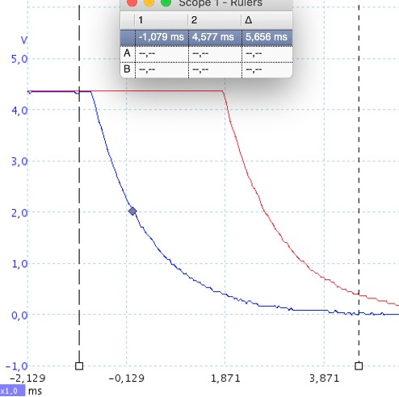

# Rotary Encoder II Plugin
___by 7h0mas-R___

This is an alternative implementation of a rotary encoder driver for integration with Volumio. It dynamically loads device tree overlays to access the rotaries and is more responsive with the tested encoders than the existing plugin.   

### Content
* [Configuring the plugin](#configuring-the-plugin)
* [Simple Test-Setups on a Breadboard](#test-setups)
* [Debouncing (tips for hardware debouncing)](#tips-for-debouncing-your-encoder)
* [Some basics about Hardware Design (Pull-Up, Pull-Down, Rotary Encoders, RC-filter)](#some-basics-about-hardware-design)
* [Debugging Instructions](#debugging-instructions)
* [Linux Device Tree Overlay - Rotary Encoder (How the plugin works)](#linux-device-tree-overlay-rotary-encoder)
* [Compatible Encoders](#list-of-compatible-rotary-encoders)
* [Potential future extensions](#potential-future-extensions)
* [Differences compared to _Rotary Encoder Plugin_ ](#differences-compared-to-rotary-encoder-plugin)
* [Known issues and limitations](#known-issues-and-limitations)
* [References](#references)


## Configuring the Plugin
[back to TOC](#content)

The plugin currently supports up to three encoders. The code is implemented in such a way, that this can quite easily be expanded - feel free to create a branch and do it.  
After installing the plugin, each encoder can be individually enabled in the settings.

       
**Img 1:** _Settings for one of the encoders_

After enabling an encoder, the following parameters can be set:
### Periods per step
There are different encoder types in the market. Many of them have a ratchet mechanism, so you can feel 'click' positions when you turn the knob.  
There are three different implementations in the DT overlay driver:

***1/1: Full period per step***    
From one tick to the next, both switches of the encoder perform a full cycle *on - off - on* (or vice versa).

***1/2: Half period per step***    
From one tick to the next, both switches of the encoder perform half a cycle *on - off* (or vice versa)

***1/4: Quarter period per step***    
From one tick to the next, only one of both switches of the encoder changes state. The other switch will change state with the next click in the same direction.

If you are uncertain about your type, check the manufacturers datasheet or use a multimeter to measure the situation in your rotary.

    
**Img 2:** _Switching characteristic of different rotary types supported._


### Pin A GPIO/ Pin B GPIO
The GPIO pins that are connected to the A and B channels of your encoder.

### Dial Function
Pick the functionality you would like for your encoder:
- Volume down/up
- Skip previous/next
- Seek backwards/forward
- Emit websocket message<br>

The Emit function opens four additional text boxes for providing the websocket commands and data for clockwise (CW) and counter-clockwise (CCW) turns. It allows, to provide commands to a websock emitter and can be used to trigger other functions inside other plugins. For example, if you have a Plugin named "MyDimmer" in the plugin category "System Hardware" controlling a Dimmer with a function `dim` taking an argument `'up'` or `'down'` you would need to put the following:

**Call Function on Plugin**:
- Command CW: `callMethod`
- Command CCW:  `callMethod`
- Data CW: `{"endpoint":"system_hardware/dimmer","method":"dim","data":"up"}`
- Data CCW: `{"endpoint":"system_hardware/dimmer","method":"dim","data":"down"}`

You could also send Volumio Volume or Skip functions via this option (just to give you an idea):   
**Volume**: 
- Command CW: `volume`
- Command CCW: `volume`
- Data CW: `+` 
- Data CCW: `-`

**Skip**:
- Command CW: `prev`
- Command CCW: `next`
- Data CW: `{}` (empty, _prev_ takes no argument) 
- Data CCW: `{}` (empty, _next_ takes no argument)

**WARNING:**    
If you use the _Emit_ function, remember that a fast turn of the knob can send a lot of messages in short time, so the called function better be fast or prepared for 'flooding'.    
To assure fault-free operation is your responsibility in this case.

### Button GPIO
GPIO pin of your device that is connected to the encoder push button. 

### Debounce Time
If you do not have hardware debouncing for your push button, you can set a software debouncing time here. The unit is milliseconds, try values below 100ms, everything higher may generate poor user-experience.

### Button Logic-Level Active Low
By default the plugin assumes, that your GPIOs are pulled low and that the GPIO will become logical high, when you push the button. If your hardware works the other way round and your button pulls the GPIO low when pressed, you have to activate this switch.

### Short Press Action/ Long Press action
Various functionalities that can be associated with the push button. For compatibility I have added most functions that the initial _Rotary Encoder Plugin_ supports. Additionally there is a an Emit Function equivalent to the one available for the rotation. You find more information there.    
Long press action is executed if the button is pushed for longer than 1.5 seconds.   
Available Commands:
- Play
- Pause
- Play/Pause toggle
- Stop
- Repeat
- Random
- Clear Queue
- Mute
- Unmute
- Toggle Mute
- System Shutdown
- System Reboot
- Emit websocket message

## Test Setups
Below are some simple test-setups which you can try out on a Breadboard. They do not use the most sophisticated hardware debouncing, but already work very smoothly. If you want to improve debouncing, refer to the next chapter with tips.    
    
**Img 3:** _Rotary Encoder on a Breadboard with three 10kΩ Pull-ups and a 100nF capacitor for debouncing of the switch. GPIO 5 & 6 are used for the rotation and GPIO 13 get's connected to the switch._

   
**Img 4:** _KY-040 on a Breadboard with a 10kΩ Pull-up. Also here, GPIOs 5,6 and 13 are used._

   
**Img 5:** _KY-040 on a Breadboard without Pull-up. In this setup, you have to make sure, that the internal pull-up is enabled. If it is not, you may get unreliable behavior. And guess what, we use GPIOs 5, 6 and 13 again._

## Tips for debouncing your Encoder
[back to TOC](#content)

Most encoders are very simple devices, that only consist of two mechanical switches, that are mechanically matched to toggle at different angular positions.   
Like all mechanical switches, they are not digitally flipping between on and off, but tend to 'bounce' between both states. That is not a problem if you switch a slow bulb, but a fast microprocessor input will notice.


    
**Img 3:** _Oscilloscope trace of one channel of an ALPS rotary encoder. You can see the bouncing during the transition from off to on. The bounce here takes about 400µs. The ALPS specification allows even up to 2ms._    

To filter the high frequency signals (the spikes) out, you can use a simple extension of your circuit with two resistors (R1 and R2) and a capacitor (C1) per channel.
I use four resistors of R=10kΩ and two capacitors of C=100nF. The timeconstant for charging is     
     
and for discharging     
    
respectively (after the timeconstant has passed the charge will be on _1/e_ of its reference level).      

    
**Img 4:** _Schematic of rotary with RC-filters for debouncing. C1 gets charged via R1+R2 when the switch is open and discharged via R2 when it is closed. The same setup is copied for the second channel._

This will remove the spikes but also slow down the transition between the states of the switch. As long as it is fast enough, that usually is no issue. To estimate what 'fast enough' means, consider the number of detents of your rotary and how fast you need to turn it (mine has 30 detents per revolution and a normal user does less than half a turn per second, so worst case there is a switch every 1000/20 = 50 Milliseconds).  

    
**Img 5:** _Both channels with RC-filter. The transition takes 6ms now(~10 times longer, still 10 times faster than needed), but the spikes are gone. I calculated the RC values based on the ALPS spec of up to 2ms bounce. You can see, that the voltage (i.e. charge on the capacitor) has reduced from 4.3V to 4.3V/2.7 = 1.6V after about 1ms, as expected with 10kΩ and 0.1µF._   

    
**Img 6:** _Both channels during a longer extra fast rotational move of about 120°. You can feel 10 'clicks' during the move shown (1/2 period per step). The speed of rotation determines the length of the peaks. When the speed increases much more, the peaks will not reach the high and low levels anymore, eventually causing problems when the GPIO can no longer distinguish a high from a low. This has to be taken into account when selecting your R and C. The turn shown is much faster, than what I expect to see from my normal user._   

If you want more crisp transitions with full amplitude again, you can add an additional Schmitt-Trigger like the _74HC 14_ (6-channels for less than 0.50€) on top of the RC-filter. That will change your rotary encoder signal to something very sharp and defined. However, make sure that input level still passes the upper and lower threshold of the Schmitt, if you turn the button fast.

    
**Img 7:** _The output of the RC-Filter connected to an additional Schmitt-Trigger. You should add a 100nF buffer-capacitor between VCC and GND and floating inputs should be pulled to a reference potential. (both not shown here)_

       
**Img 8:** _Input (red) and Output (blue) of the Schmitt-Trigger. You can see, that the signal makes a very sharp transition from low to high when the input falls below the threshold. Note, that the output is inverted, but for the rotary operation that does not matter._

      
**Img 9:** _Both channels with Schmitt-Trigger. A signal like from a text-book for digital logic. Note how you can even see the acceleration during the turn. The squares become shorter from left to right._   


## Some Basics about Hardware Design
[back to TOC](#content)   
This section is for those users, who do not have experience with electronics but are still enthusiastic to play with their Raspi and Volumio to realize their own project.

I do not claim, that this is the ultimate guide, but many of the problems reported by people on the forums seem to come from basic mistakes in the hardware setup. So here come some tipps for a robust design.

### Raspberry Pi Do's and Dont's
[back to TOC](#content)
* GPIO pins are specified for 3.3V (3V3), do not connect them to higher voltages even if a YouTuber or a DIY web-page tells you that it can withstand it. You are operating outside the specification and misuse the ESD protection. Overvoltage should stay a rare 'event', not become a continuous state. 
* Even if you only connect 3.3V, higher spikes are possible, due to electro-static discharge (ESD), capacitive and inductive components (like long cables). Take care of ESD, use a limiting resistor and a capacitor to control the slew (how fast the voltage on the pad changes). Do not use unneccessarily long cables, connect GND before connecting any signal...
* Never short a power output directly to ground, your Pi *may* survive, but it may also die. You are operating beyond the AMR values (absolute max ratings), where Powers beyond the engineers influence are at work - the danger zone.

The image below shows quite a safe external wiring schematic for an RPi GPIO, that works in most cases, if the resistor and capacitor values are picked correctly. Below I try to explain, what to consider when picking them.


*The left schematic shows a GPIO with a Pull-up resistor R_PU, a limiting resistor R_lim and a decoupling capacitor C. The right hand side has the same schematic but with a Pull-Down resistor instead.*

### What is a Pull-Up or Pull-Down Resistor and why do I need it?
[back to TOC](#content)   
A digital input pin that is not connected to any defined reference potential is isolated from its surroundings. It can have any electric potential, meaning that its voltage compared to GND can have all kinds of values, depending on the charge it carries and potentially changing with electromagnetic fields in its vicinity. 

It is called a 'floating' pin. And since it is something like a tiny capacitor or even worse, a tiny antenna, depending on its charge, it may be in the logical HIGH state (>1.6V for a RPi input), but also in the logical LOW state (<0.9V) - or anywhere in between.
A floating input is undesirable, because its state is undeterminate and so is its behavior when reading it.
This is overcome, by connecting it to either HIGH (3.3V) or LOW (0V) potential via a resistor.

*Schematics of a simple pull-up (PU) and pull-down (PD) resistor. If the switch is open, the GPIO is on the same potential (i.e. it has the same voltage) as the reference (PU:3.3V, PD:GND). When the button is closed, a small current flows from 3.3V to GND and the potential at the GPIO changes (PU:GND, PD:3.3V). You could also interpret the combination of resistor and switch as a voltage divider, where the open switch has infinite resistance and the closed switch 0 Ohms. The full voltage will always 'drop' across the larger of the two in this case.*

The Raspberry Pi has integrated Pull-up and Pull-down resistors inside its microprocessor chip, which can be activated by the system at boot time. But it is also possible to connect external resistors to the pin (and there are reasons to do so). [See below](#why-does-it-matter-for-playing-with-my-raspberry-pi).

### What is a limiting resistor?
[back to TOC](#content)   
A limiting resistor is connected to the GPIO pin in such a way, that all current into or out of the pin has to pass the resistor. The limiting resistor will determine the maximum current out of the pin.
When configured as output, the pin has minimum current values that it can safely drive, to give a well-defined HIGH and LOW state, called I_OH and I_OL. Anything larger than that is not guaranteed and you should design to stay below it.

Suppose you connect a circuit to your RPi, that shorts a GPIO to GND, because you configured it as input and want to drive it low. Suppose now, that you load a software, that wants to use the same pin as output and configures it to HIGH. What happens is, that the RPI tries to bring the pad up to 3.3V, while it is shorted to GND - it will not succeed, but it may get permanently damaged doing so. 

The same thing happens, if the pad is connected to 3.3V and you configure it as output and try to put it to LOW. Now the Pi will try to pull the pad to 0V and current will flow uncontrolled into the pad. The limiting resistor will keep the current limited, even if you accidentally load a software that mis-configures your GPIO. 

1kOhm will limit the current to 3.3V/1kOhm = 3.3mA, which should be low enough, to get the high level at 2.6V or higher and the LOW level at 0.4V or lower, since both are specified at 4mA drive strength. So even an accidental setting as output will never damage your pin. 2kOhm may even be a better choice, since the Pi can supply only 3mA on all pins simultaneously.
See the [Raspberry Pi Documentation for details](https://www.raspberrypi.com/documentation/computers/raspberry-pi.html#voltage-specifications).

### What is the capacitor good for?
[back to TOC](#content)    
The capacitor between the GPIO and ground will smooth things out - it will attenuate mechanically induced bounce and ringing from the line and will reduce high frequency noise. Thus it will help protect your input and make the signal more stable. It will also generate less interrupts at the GPIO, because the smoothing out of high-frequency noise will reduce the edges, that the microprocessor needs to react on.
Together with the resistors is forms an RC-filter. You can either use *C=100nF* as a rule of thumb or calculate the proper value based on your button bounce specification as shown in the [Debouncing section](./01_Debouncing.md).

### Do I need all those three elements?
[back to TOC](#content)   
Well, yes and no. It depends on your use of the system. As explained, using all three of them adds some safety and protection to your GPIO. It makes damaging it more unlikely. 
However, you can leave out the pull-resistor and use the internal ones and you can leave out the limiting resistor, if you make sure the input is never accidentally reconfigured the wrong way. You can also leave away the capacitor - but without the three cheap components, the system has a less robust design and leaves more responsibility with the user and the programmer.

### How does it work with a Rotary Encoder and the RPi?
[back to TOC](#content)   
A modern GPIO (General Purpose Input/Output) in a microprocessor typically has plenty of configurable properties. It can be an input or an output or in a High-Impedance (high-Z) state. The input can be floating, have a pull up or a pull down. The output sometimes has configurable drive strength etc.

To connect buttons and rotary encoders (which are actually kind of buttons) we typically use the GPIOs as inputs. Many GPIOs are already configured as inputs for Volumio and may have either have the built-in pull-up (PU) or pull-down (PD) resistors enabled. The internal pull-resistors of the RPi [are around 50-65kOhms](https://www.raspberrypi.com/documentation/computers/raspberry-pi.html#voltage-specifications).

With the right external components, it does not matter too much, how the inputs are actually configured, as long as they are inputs and not used by other hardware (e.g. the I2S-DAC).


*Simplified schematic of the internal wiring of a GPIO pin. Output functionality is not shown for simplicity. The input pin (GPIO) is internally connected to GND and and 3.3V via two protective diodes, for Overvoltage and ESD protection. The input itself is then connected to a Schmitt-Trigger, that has a high-impedance input. To prevent the input from floating, it can be either wired to 3.3V via the PU or to GND via the PD. Instead of a switch, the internal Pulls are activated via CMOS devices.
It is also possible, to deactivate both - the GPIO will have high impedance and may float if not externally pulled.*

### Is it a problem if I use internal and external Pull-resistors at the same time?
[back to TOC](#content)    
Even if the interal PU or PD is set, you can still connect an external PU or PD. Just be aware, that the values need to match each other.


*Example of a circuit with internal Pull-up activated and external Pull-down + limiting Resistor connected. This is still working without issues, if the resistor values are matching.*

What happens if you activate internal PU and connect an external PD? 
* Switch open:
    * Current of *I = 3.3V / (R_PU + R_lim + R_PD)* will flow from the internal 3.3V rail via the R_PU to the pin and then via R_lim and R_PD to GND.
    * The voltage at the input of the Schmitt-Trigger will be *V_in = 3.3V x (R_PD + R_lim) / (R_PD + R_PU + R_lim)*
    * Since the input is supposed to be logical LOW, the [V_in should be  <= V_IL=0.9V](https://www.raspberrypi.com/documentation/computers/raspberry-pi.html#voltage-specifications). 
    This means, that *R_PD + R_lim <= R_PU / (3.3V / 0.9V - 1)=18.75kOhm* (with R_PU = 50kOhm). This means, that the external pull-down resistor should be smaller than 16.75kOhms if we pick *R_lim = 2kOhm*. Otherwise, the voltage-devider formed by external and internal resistor will bring your voltage at the Schmitt-Trigger Input into the undefined zone between HIGH and LOW. 10kOhm is a typical value. 
    * The current over all the three resistors will only be *3.3V/(50kOhm + 2kOhm + 10kOhm) = 53µA*
    * If the the GPIO gets accidentally configured as Output and pulled high, the current will be 275µA.
* Switch closed:
    * Current will flow over the switch and the external PD and will be *I = 3.3V / 10kOhm = 330µA*
    * Voltage at the Schmitt-Trigger input will be the full *V = 3.3V*, since the internal PU is shorted by the switch.
    * If the GPIO gets accidentally configured as output and pulled low, the current will be 1.65mA

If the internal PU is configured and you connect an external PU on top, there will not be a lot of changes, since you basically just add a parallel resistor to the internal one *1/R_total = 1/(R_int + R_lim) + 1/R_ext)*. That will increase the current flowing, but not to a critical level.
The voltage at the Schmitt-Trigger input will be determined by the voltage devider formed by internal PU and R_lim.

### How to determine the default configuration of your GPIOs?
[back to TOC](#content)
* By default, GPIO BCM2...8 should be pulled high at boot and GPIO BCM9...27  pulled-low.
* On Raspberry Pi 4, you can issue `raspi-gpio get` to read the current setting of the GPIO pins
* On older versions of the Pi, this is not available and there is no simple method to determine the state
* Using a multimeter to measure the voltage at the pin is not reliable, since the multimeter is high-ohmic and may not correctly show the voltage of a floating pin
* You can try to read out the pin state directly after boot, but that may also give you wrong info for floating pins because it just gives you the reading at the Schmitt-Trigger (remember the paragraph about pull-up and pull-down resistors).
* Below is the output of a `gpio readall` on one of my Volumio RPi's.

```
 +-----+-----+---------+------+---+---Pi 2---+---+------+---------+-----+-----+
 | BCM | wPi |   Name  | Mode | V | Physical | V | Mode | Name    | wPi | BCM |
 +-----+-----+---------+------+---+----++----+---+------+---------+-----+-----+
 |     |     |    3.3v |      |   |  1 || 2  |   |      | 5v      |     |     |
 |   2 |   8 |   SDA.1 | ALT0 | 1 |  3 || 4  |   |      | 5v      |     |     |
 |   3 |   9 |   SCL.1 | ALT0 | 1 |  5 || 6  |   |      | 0v      |     |     |
 |   4 |   7 | GPIO. 7 |   IN | 1 |  7 || 8  | 1 | ALT0 | TxD     | 15  | 14  |
 |     |     |      0v |      |   |  9 || 10 | 1 | ALT0 | RxD     | 16  | 15  |
 |  17 |   0 | GPIO. 0 |   IN | 0 | 11 || 12 | 0 | IN   | GPIO. 1 | 1   | 18  |
 |  27 |   2 | GPIO. 2 |   IN | 0 | 13 || 14 |   |      | 0v      |     |     |
 |  22 |   3 | GPIO. 3 |   IN | 0 | 15 || 16 | 0 | IN   | GPIO. 4 | 4   | 23  |
 |     |     |    3.3v |      |   | 17 || 18 | 0 | IN   | GPIO. 5 | 5   | 24  |
 |  10 |  12 |    MOSI |   IN | 0 | 19 || 20 |   |      | 0v      |     |     |
 |   9 |  13 |    MISO |   IN | 0 | 21 || 22 | 0 | IN   | GPIO. 6 | 6   | 25  |
 |  11 |  14 |    SCLK |   IN | 0 | 23 || 24 | 1 | IN   | CE0     | 10  | 8   |
 |     |     |      0v |      |   | 25 || 26 | 1 | IN   | CE1     | 11  | 7   |
 |   0 |  30 |   SDA.0 |   IN | 1 | 27 || 28 | 1 | IN   | SCL.0   | 31  | 1   |
 |   5 |  21 | GPIO.21 |   IN | 1 | 29 || 30 |   |      | 0v      |     |     |
 |   6 |  22 | GPIO.22 |   IN | 1 | 31 || 32 | 1 | IN   | GPIO.26 | 26  | 12  |
 |  13 |  23 | GPIO.23 |   IN | 0 | 33 || 34 |   |      | 0v      |     |     |
 |  19 |  24 | GPIO.24 |   IN | 0 | 35 || 36 | 1 | IN   | GPIO.27 | 27  | 16  |
 |  26 |  25 | GPIO.25 |   IN | 0 | 37 || 38 | 0 | IN   | GPIO.28 | 28  | 20  |
 |     |     |      0v |      |   | 39 || 40 | 0 | IN   | GPIO.29 | 29  | 21  |
 +-----+-----+---------+------+---+----++----+---+------+---------+-----+-----+
 | BCM | wPi |   Name  | Mode | V | Physical | V | Mode | Name    | wPi | BCM |
 +-----+-----+---------+------+---+---Pi 2---+---+------+---------+-----+-----+
 ```

 The table shows an ASCII representation of the pin header in the center + additional info:
 * Physical pins with physical numbering in the center (Pin 1 has a square solderpad on the RPi PCB)
 * The columns titled *V* show you the current value of the pin. 1 means logical *High* and 0 means logical *Low*. Since nothing is connected, This typically tells you, if the pin has the internal Pull-up or Pull-Down resistors activated, but for a floating pin, it can be random.
 * Mode tells you, how the pin is configured:
    * IN is an Input, e.g. for connecting a button or rotary encoder
    * OUT is an Output, e.g. for connecting an LED
    * ALTx is an alternative assignment, e.g. a communication interface (SPI, I2C, ...)
* Name is the name of the pin and tells you something about it's function:
    * 3.3v and 5v are outputs (as mentioned, never connect the 5v to a GPIO)
    * 0v is a Ground (GND) pin - this is the reference potential for your schematic
    * GPIO.xx is a *General Purpose Input/Output* meaning, that you are free to configure it as you need
    * SDA, SCL, MOSI, MISO, SCLK, TxD, RxD, CE0, CE1 are various communication interfaces (you can google for RS232, SPI, I2C for details)
be carefull, there are breakout-boards that use the BCM numbering, mine e.g. has 'GPIO21' printed beside pin 40.
* wPi column contains the Pin number in the wiringPi notation (same as in the GPIO name)
* BCM tells you the *Broadcom* pin number as in the datasheet of the Manufacturer of the RPi microprocessor **This is the Pin number that is used in the Plugin settings**

**ATTENTION: Careful what pin numbering you use!**

As you can see from the table, my GPIOs with BCM2...8 are '1' as expected, but BCM12 and BCM16 are also high, while they should be low according to online sources. So it is hard to rely on this info. Making a safe design even more important.

If you connect a DAC like e.g. HifiBerry to the Pin-Header, it will reserve some pins for various functions. Those pins cannot be used for any other purpose. Check in the documentation of the HAT or try to figure out by running `gpio readall` with the HAT connected and the driver loaded.

### How to wire a rotary encoder and especially the KY-040
[back to TOC](#content)   
Since many people report problems with wiring their rotary encoder, I'll show an example for clean wiring to your Raspberry Pi. This is not the minimal solution and you can do it with less components, but if you play with your Raspberry, it will add some safety to your schematic.


*The image shows a rotary with three pull-up resistors (green), three limiting resistors (orange) and three capacitors, that reduce bounce and control the edge of the signal. For any regular rotary encoder, this is a working solution.
The KY-040 used by some people on their Volumio system, is a rotary encoder soldered to a small PCB with two pull-up resistors already included in the same board. I indicate that by the red dashed box. If you use it, you will not need Pull-Ups for the two channels of the rotation. You may still want to add limiting resistors and decoupling capacitors to the KY-040, potentially with an extra pull-up or pull-down for the switch.*


## Debugging instructions
[back to TOC](#content)   
I have written and tested the plugin as good as I could with the hardware available to me. However, there are many different RPi's, Rotary Encoders, Schematics etc. and it may not be working with your hardware. If you ask for support in the Plugin-Thread on the Community forum, I may ask you to help me figuring out if there is a bug.
Below are instructions I may ask you to follow, to analyze the situation on your system.

### General info to be included in Bug-reports:
In case you want to file a bugreport or ask for help, please include:
* Hardware you are using
* Volumio version
* Plugin Version
* Peripheral hardware info (Rotary used, debouncing, GPIOs used)
* Logfile showing complete use example with the bug (see step-by-step instructions below)
  * Start of the plugin
  * The sequence of use that produces the problem
  * Stop of the plugin

<details>
<summary><b>How to generate a log (expand to read)</b></summary>
<ol>
<li>Acitvate logging in the <a href="http://volumio.local/plugin/system_hardware-rotaryencoder2">Plugin's settings</a> by going to the 'Debug settings' section and setting 'Logging' to 'On'. Don't forget to save
<li>Create a log-file by either of these methods:
<ol type="a">
<li>via Browser
<ol type="i">
<li>Go to the <a href="http://volumio.local/dev">Volumio developer settings</A> and 'enable' the 'Live Log'
<li>Go to the 'Installed Plugins' page in Volumio
<li>Switch the Plugin 'off' - wait a few seconds - switch it 'on' again
<li>Now do whatever you normally do to produce the error
<li>After the error happened, switch the plugin 'off' again
<li>Go back to the developer settings, disable the Live Log and copy the log out of the window. 
<li>Put the log into a text file and send it to me via PN or, if you really think you need to post it here, make sure to use a <a href="https://docs.gitlab.com/ee/user/markdown.html#collapsible-section">collapsible section</a>.
</ol>
<li>via <code>SSH</code>:
<ol type="i">
<li>Log into your Volumio system using <code>SSH</code>, if you do not know how, Google is your friend
<li>At the prompt <code>volumio@volumio:$</code> enter <code>journalctl -f</code>. This will start the logging to the terminal you are using.
<li>Follow steps ii. - v. under a. (plugin on - produce error - plugin off)
<li>In your Terminal, hit <code>Ctrl-C</code> to stop the logging
<li>Copy the log out of the terminal and send it like describe in step vii. under a.
</ol>
</ol>
</ol>
</details>
<p>

### Check if the overlays are properly installed
Step-by-step:
* ssh into volumio
* issue `dtoverlay -l`
* the response in your case should look similar to this (depending on your settings for GPIOs and encoder type): 
```
0:  rotary-encoder  pin_a=5 pin_b=6 relative_axis=true steps-per-period=1
1:  rotary-encoder  pin_a=8 pin_b=9 relative_axis=true steps-per-period=1
```
### Check if the dtoverlays are working independent of the plugin
Step by step:
1) disable the plugin
2) `ssh` into volumio
3) Install the problematic overlay by issuing:
`sudo /usr/bin/dtoverlay rotary-encoder pin_a=5 pin_b=6 relative_axis=true steps-per-period=1`  
(replace the `pin_a` and `pin_b` numbers by your GPIO numbers and the `steps-per-period` by 1, 2 or 4, depending on your rotary type (1/1, 1/2, 1/4))

4) Open a terminal window and `ssh` into Volumio
5) Issue the `od` command into one terminal window:
`od -x -w32 /dev/input/by-path/platform-rotary\@5-event`    
(attention, the number is the pin_a number in hex, so 10 would become `A`, 18 becomes `12` and so on. You can check for the available values with `ls /dev/input/by-path` or use the terminals auto-completion feature) 
6) Now, turn the dial of the rotaries, there should be some output on the terminal, similar to this: 
    ```
    0000000 192b 62f0 010d 000f 0002 0000 0001 0000 192b 62f0 010d 000f 0000 0000 0000 0000
    0000040 192d 62f0 178b 000a 0002 0000 0001 0000 192d 62f0 178b 000a 0000 0000 0000 0000
    0000100 192e 62f0 075b 0005 0002 0000 0001 0000 192e 62f0 075b 0005 0000 0000 0000 0000
    0000140 192f 62f0 9924 000d 0002 0000 ffff ffff 192f 62f0 9924 000d 0000 0000 0000 0000
    0000200 1930 62f0 65ed 0005 0002 0000 ffff ffff 1930 62f0 65ed 0005 0000 0000 0000 0000
    0000240 1931 62f0 92d4 0000 0002 0000 ffff ffff 1931 62f0 92d4 0000 0000 0000 0000 0000
    ```
7) after the test, remove the overlay with `sudo dtoverlay -r` 

If everything works fine up to 6), then the `dtoverlay` configuration works and there is probably an issue with the plugin.
The output of `od` is structured like this:
- Column 1: Pseudo-address of the first byte printed
- Column 8/9: Direction in `signed Char` format (i.e. `ffff ffff`=-1 and `0001 0000`=1)


## Linux Device Tree Overlay: Rotary Encoder
[back to TOC](#content)   
Even with a perfect signal from RC-filter and  Schmitt-trigger, there were still missed ticks sometimes. I could solve that by moving to the DT overlay driver for rotary encoders.     

Raspbian (and Volumio) support it out of the box. If you load the device-tree overlay for a rotary, you no longer need to take care of the Gray-Code and just hook up to a device that will nicely send you information about turns of the rotary encoder (relative or absolute, the plugin only supports relative so far).

The advantages of the dtoverlay solution:
- Very fast response, due to Kernel level implementation
- Versatile driver for use with all kinds of encoder types
- The dtoverlays can dynamically be loaded and unloaded, so integration was quite straightforward.

The plugin basically executes calls to dtoverlay for adding and removing overlays:   
To add a rotary:
```
sudo dtoverlay rotary-encoder pin_a=17 pin_b=27 relative_axis=1 steps-per-period=2 
```
To remove a rotary:
```
sudo dtoverlay -r 
```

The plugin is doing this when you change and save settings. You do not need to go to the command line.  
Source-code of the driver [can be found here](https://github.com/raspberrypi/linux/blob/rpi-5.15.y/drivers/input/misc/rotary_encoder.c).

## List of compatible Rotary Encoders
[back to TOC](#content)   
The list currently lists only the ALPS Encoder I used for my project. I am convinced, that it works with others as well. I found some other projects using dtoverlay that use KY040 for example or other ALPS types.   
**_Please add yours to the list to help others. If you do not know how to edit this file in Github, create an issue with the information and I will integrate it someday._**

|Manufacturer|Model       |Periods/Position|HW-Debounce used     |Tested by          |
|------------|------------|----------------|---------------------|-------------------|
|ALPS        |STEC11B03   | 1/2            |RC + Schmitt-Trigger |[7h0mas-R](https://github.com/7h0mas-R)           |
|ALPS        |STEC11B03   | 1/2            |none (PU only) |[7h0mas-R](https://github.com/7h0mas-R)           |
|Bourns      |PEC12R-4217F-S0024| 1/2      |RC                   |[Darmur](https://github.com/Darmur)
|*several*     |KY-040 | 1/2 (?)|none (PU only) |[Mr100000Volt](https://community.volumio.org/t/plugin-rotaryencoder-ii/48538/107?u=t0mr0)

## Potential future extensions
[back to TOC](#content)
- add the other parameters offered by the dtoverlay (e.g. absolute positioning, binary instead of Gray-code etc.)
- Add support for more than 3 encoders
- Add support for dtoverlays loaded at boot (similar to overlays for I2S DACs)

## Differences compared to _Rotary Encoder Plugin_ 
[back to TOC](#content)    
The initial rotary encoder plugin by _Saiyato_ is built based on npm OnOff library and a derived onoff-rotary to read the GPIO pins of the Linux system (e.g. Raspberry Pi).  
With my custom made hardware using three _ALPS STEC11B03_ encoders, it worked but the response was not really satisfactory because the plugin would only respond on every second 'tick' of the encoder and would sometimes misinterpret the direction.  
I tried to improve it with hardware debouncing (see [here](./01_Debouncing.md#tips-for-debouncing-your-encoder) for tips) and by optimizing the implementation but the result was not satisfactory.      
I finally wrote my own implementation based on DT overlay driven rotary encoders giving me perfect results. 
I first thought about implementing my solution into the existing plugin, but finally decided against it due to lack of time and because is rather an alternative than an extension.   
If your system does not support DT overlays or you run into other issues, the other plugin may still be your first choice. 
Feel free to try both Plugins and pick the one, that suits your application best.     
If this Plugin works for you and you use a new type of encoder, it would be nice if you drop me a note, so I can add it to the list of supported encoders.   
If you should observe problems, you can try to post on the [community forum](https://community.volumio.org/t/plugin-rotaryencoder-ii/48538). I rely on enthusiasts to dig into the limitations of the plugin - the debug function in the settings is very chatty, so it should help to get to the issue fast.

Overview of differences between plugins:     
- Rotary Encoder original
    - Uses npm [`onoff_rotary`](https://github.com/pichfl/onoff-rotary) under the hood, which itself basically uses two inputs configured via [`onoff`](https://github.com/fivdi/onoff) to read out the rotary. Source [can be found here](https://github.com/pichfl/onoff-rotary/blob/master/index.js)
    - `onoff` itself uses `/sys/class/gpio` and `epoll` to monitor the inputs
- Rotary Encoder II 
    - Uses the Linux Kernel's `dtoverlay` to load a built-in driver for monitoring of a rotary encoder connected to two GPIO's
   - Information [can be found here](#linux-device-tree-overlay-rotary-encoder)


## Known issues and limitations
[back to TOC](#content)
### Kernel warning when last overlay is removed
When the plugin is disabled, a kernel warning message about a potential memory leak is displayed when the last overlay is removed. I tried several things to prevent it and posted to several forums looking for help, but could not get rid of it. 
I consider it as not nice, but I could also not observe any issue after multiple disable/enable loops - so I decided to keep it as is for the time being.
During normal use, the plugin will be configured once only and then loaded at boot and unloaded at shutdown - so you should never experience an issue. I use it for several months already without issues.    
  

## References
[back to TOC](#content)
### Device Tree Documentation
- [Kernel Documentation: rotary-encoder](https://www.kernel.org/doc/Documentation/input/rotary-encoder.txt)   
Explains more about how a rotary works and how the DTOverlay is implemented
- [Documentation of the `dtoverlay` command](https://github.com/raspberrypi/firmware/blob/master/boot/overlays/README)   
Search for 'rotary-encoder'. Alternatively, you can call 
  ```
  dtoverlay -h rotary-encoder
  ```
  from the command line.
- [Documentation of the Raspberry Device Tree](https://www.raspberrypi.org/documentation/configuration/device-tree.md)   
If you would like to learn more about the details of the dtoverlay function.

### NPM modules used
- [onoff](https://www.npmjs.com/search?q=onoff)   
Since it was easier to implement and does not have any issues, I still use _onoff_ for the push button. This could also be done with _dtoverlay_, but seems too much effort since it does not provide additional performance.

### Hardware Resources
- [RPi GPIOs](https://www.raspberrypi.org/documentation/hardware/raspberrypi/gpio/README.md)

